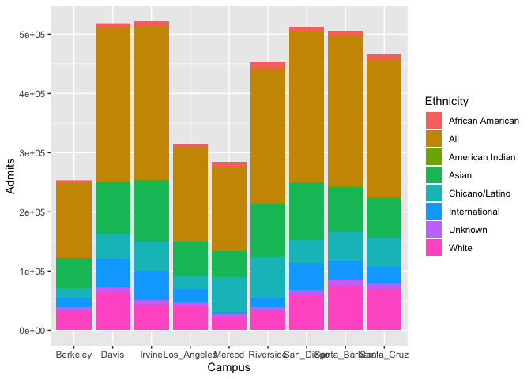

## Instructions
Answer the following questions and complete the exercises in RMarkdown. Please embed all of your code and push your final work to your repository. Your final lab report should be organized, clean, and run free from errors. Remember, you must remove the `#` for any included code chunks to run.  

## Libraries

```r
library(tidyverse)
library(shiny)
library(shinydashboard)
```

## Data
The data for this assignment come from the [University of California Information Center](https://www.universityofcalifornia.edu/infocenter). Admissions data were collected for the years 2010-2019 for each UC campus. Admissions are broken down into three categories: applications, admits, and enrollees. The number of individuals in each category are presented by demographic.  

```r
UC_admit <- readr::read_csv("data/UC_admit.csv")
```

```
## Parsed with column specification:
## cols(
##   Campus = col_character(),
##   Academic_Yr = col_double(),
##   Category = col_character(),
##   Ethnicity = col_character(),
##   `Perc FR` = col_character(),
##   FilteredCountFR = col_double()
## )
```

```r
UC_admit
```

```
## # A tibble: 2,160 x 6
##    Campus Academic_Yr Category   Ethnicity        `Perc FR` FilteredCountFR
##    <chr>        <dbl> <chr>      <chr>            <chr>               <dbl>
##  1 Davis         2019 Applicants International    21.16%              16522
##  2 Davis         2019 Applicants Unknown          2.51%                1959
##  3 Davis         2019 Applicants White            18.39%              14360
##  4 Davis         2019 Applicants Asian            30.76%              24024
##  5 Davis         2019 Applicants Chicano/Latino   22.44%              17526
##  6 Davis         2019 Applicants American Indian  0.35%                 277
##  7 Davis         2019 Applicants African American 4.39%                3425
##  8 Davis         2019 Applicants All              100.00%             78093
##  9 Davis         2018 Applicants International    19.87%              15507
## 10 Davis         2018 Applicants Unknown          2.83%                2208
## # … with 2,150 more rows
```

**1. Use the function(s) of your choice to get an idea of the overall structure of the data frame, including its dimensions, column names, variable classes, etc. As part of this, determine if there are NA's and how they are treated.**  

##There are more NA when I pivot wider to split "Category" into 3 separate variables.

```r
UC_admit %>% 
summarise(na = sum(is.na(UC_admit)))
```

```
## # A tibble: 1 x 1
##      na
##   <int>
## 1     2
```


**2. The president of UC has asked you to build a shiny app that shows admissions by ethnicity across all UC campuses. Your app should allow users to explore year, campus, and admit category as interactive variables. Use shiny dashboard and try to incorporate the aesthetics you have learned in ggplot to make the app neat and clean.**


```r
uc_admit<-
UC_admit %>% 
  pivot_wider(names_from = "Category",
              values_from = "FilteredCountFR")

uc_admit %>% 
select(Academic_Yr, Ethnicity, Admits, Campus) %>% 
  ggplot(aes(x=Campus, y= Admits, fill= Ethnicity))+
  geom_bar(stat = "identity")
```

```
## Warning: Removed 1250 rows containing missing values (position_stack).
```

<!-- -->


```r
library("shinydashboard")
ui <- dashboardPage(
  dashboardHeader(title = "uc_app"),
  dashboardSidebar(),
  dashboardBody(
  fluidRow(
  box(title = "Plot Options", width = 3,
  selectInput("x", "Select X Variable", choices = c("Academic_Yr", "Campus"), 
              selected = "Academic_Yr"),
  selectInput("y", "Select Y Variable", choices = c("Admits", "Applicants", "Enrollees"))
  ), # close the first box
  box(title = "Plot of UC Admissions", width = 7,
  plotOutput("plot", width = "600px", height = "500px")
  ) # close the second box
  ) # close the row
  ) # close the dashboard body
) # close the ui

server <- function(input, output, session) { 
  
  # the code to make the plot of iris data grouped by species
  output$plot <- renderPlot({
    ggplot(uc_admit, aes_string(x = input$x, y =  input$y, fill= "Ethnicity")) + geom_bar(stat= "Identity") + theme_light(base_size = 18)+theme(axis.text.x = element_text(angle = 60, hjust = 1))
  })
  
  # stop the app when we close it
  session$onSessionEnded(stopApp)

  }

shinyApp(ui, server)
```

<!--html_preserve--><div style="width: 100% ; height: 400px ; text-align: center; box-sizing: border-box; -moz-box-sizing: border-box; -webkit-box-sizing: border-box;" class="muted well">Shiny applications not supported in static R Markdown documents</div><!--/html_preserve-->


**3. Make alternate version of your app above by tracking enrollment at a campus over all of the represented years while allowing users to interact with campus, category, and ethnicity.**


```r
library("shinydashboard")
ui <- dashboardPage(
  dashboardHeader(title = "uc_app"),
  dashboardSidebar(),
  dashboardBody(
  fluidRow(
  box(title = "Plot Options", width = 3,
  selectInput("x", "Select X Variable", choices = c("Academic_Yr"), 
              selected = "Academic_Yr"),
  selectInput("y", "Select Y Variable", choices = c("Admits", "Applicants", "Enrollees")),
  selectInput("fill", "Select fill Variable", choices = c("Campus", "Ethnicity"))
  ), # close the first box
  box(title = "Plot of UC Admissions", width = 7,
  plotOutput("plot", width = "600px", height = "500px")
  ) # close the second box
  ) # close the row
  ) # close the dashboard body
) # close the ui

server <- function(input, output, session) { 
  
  # the code to make the plot of iris data grouped by species
  output$plot <- renderPlot({
    ggplot(uc_admit, aes_string(x = input$x, y =  input$y, fill= input$fill)) + geom_bar(stat= "Identity") + theme_light(base_size = 18)+theme(axis.text.x = element_text(angle = 60, hjust = 1))
  })
  
  # stop the app when we close it
  session$onSessionEnded(stopApp)

  }

shinyApp(ui, server)
```

<!--html_preserve--><div style="width: 100% ; height: 400px ; text-align: center; box-sizing: border-box; -moz-box-sizing: border-box; -webkit-box-sizing: border-box;" class="muted well">Shiny applications not supported in static R Markdown documents</div><!--/html_preserve-->


## Push your final code to GitHub!
Please be sure that you check the `keep md` file in the knit preferences. 
